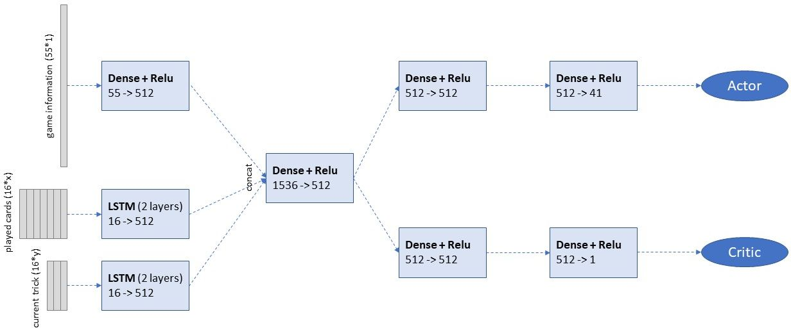
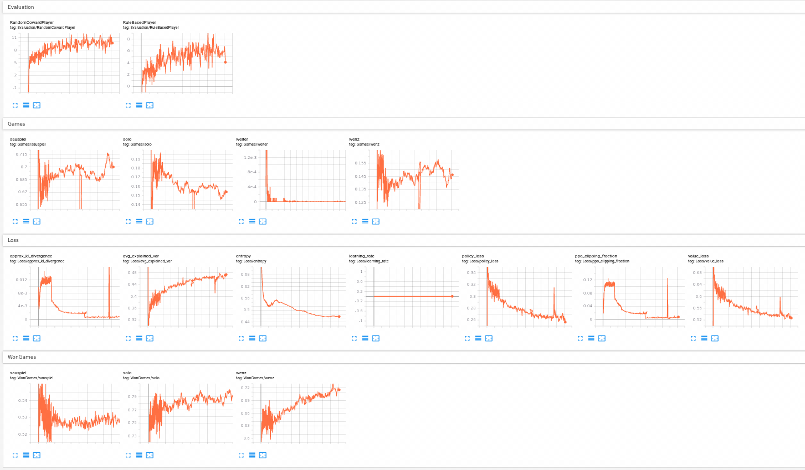

# SchafkopfRL

Framework for developing an AI agent to play the bavarian four-player card game Schafkopf. The main components of this repo are:
- <b>[Schafkopf Environment](#schafkopf-environment)</b>: A multi-agent environment that allows agents to play Schafkopf. See [Schafkopf Rules](#schafkopf-rules) for the supported rule set.
- <b>Agents</b>: A set of AI agents that are able to play with different degrees of strength
  - [RL Agent](#rl-agent): Agent that acts based on an policy neural network which is trained though proximal policy optimization. 
  - [PIMC Agent](#pimc-agent): Agent utilizing Monte-Carlo-Tree Search for imperfect information games. 
  - [Immitation Agent](#immitation-agent): Agent learning behaviour from real-world games
  - [Baseline Agents](#baseline-agents): Agents with simple hard-coded rules.
- <b>Trainer:</b>  Trainer class for training the model based-players

## Schafkopf Environment
The schafkopf environment offers the following two main functions:
- reset(): creates a new game round. Decides on the player to play first
- step(action): performs an action in the environment. Actions can be calling a game, giving contra/retour or playing a card.

both of these function return 
- the current state of the game as perceived by the current player (the player that needs to perform the next action) consisting of
  - public_gamestate: Includes all information seen by all player. E.g., dealer, called_games, played_game, played_cards so far,...
  - player_hand: A list of cards held by the current player
  - allowed_actions: A list of allowed actions to be performed by the current player
- the reward: a list containing the reward for each player. This is usually [0,0,0,0] but contains the payments of the game after the last player played his last card (e.g., [20, -20, -20, 20]).
- terminal: boolean indicator that returns true, when the last player played his last card.

A Schafkopf game has the following sequence of events:
1) bidding stage: each player starting with the player after the dealer declares a game he wants to play
2) contra stage: each player starting with the player after the dealer can double the game (if allowed according to the rules)
3) retour stage (optional): if a player gave contra in phase 2, each player (again starting with the one after the dealer) is asked if he wants to double the game
4) trick stage: each player sequentially is asked to play a card, starting with the player after the dealer (first trick) or the player who took the last trick (all other tricks)

### Schafkopf Rules
Schafkopf is a traditional bavarian 4 player trick based card game with imperfect information. It has both competetive and cooperative game elements.

There are a lot of different variations (allowed game types, allowed doubling mechanisms, ...) and reward schemes. A good overview can be found at https://en.wikipedia.org/wiki/Schafkopf

In this project I will focus on the following rules:
- Long Cards (8 cards per player)
- Allowed Games: Sauspiel, Farbsolo, Wenz
- Tariffs: 20 for Sauspiel, 50 for Solo, 10 for Schneider/Schwarz or Laufende starting from 3 (from 2 for Wenz)
- Contra/Retour before first card was played

## RL Agent
### Basic Principle

1. The policy neural network (that decides what action to take at any given game state) is randomly initialized.
2. N games are played by 4 players using the current policy (N = 50K-100K)
3. A new policy is trained trying to make good decision more likely and bad decisions less likely using PPO
4. Replace the current policy by the new one and go back to 2.

Currently, there are two policy networks available:
    
- Linear: Using a 1D vector state representation of the current game state and an Actor-Critic Network that has a linear input layer.
- LSTM: Using a complex state representation (e.g., representing played cards as sequences) and an Actor-Critic Network that also hast LSTM input layers.
### State and Action Space (LSTM variant)

The <b>state space </b> consists of three parts (necessary bits in brackets):

- info_vector (55)
  - game_type (7) [two bit encoding of color and type]
  - game_player (4)
  - first_player (4)
  - current_scores (4) [divided by 120 for normalization purpose]
  - remaining ego-player cards (32) [one hot encoded]
  - teams (4) [bits of players are set to 1, if Suchsau has been played already]
- game_history_sequence (x * 16)
    - course_of_game: x * (12 + 4) each played card in order plus the player that played it
- current_trick_sequence (y * 16)
    - current_trick: y * (12 + 4) each played card in order plus the player that played it

other players are encoded by position with respect to ego_player
The <b>action space</b> is a 43d vector that contains

- game type selection (9)
- double game (2)
- card selection (32)

### LSTM-Based Policy Network

### Example Run
Hyperparameters used for Linear: lr = 0.002, update every 100K games, batch_size = 600K, c1 = 0.5, c2 = 0.005, steps = 15M

Hyperparameters used for LSTM: lr = 0.0001, update every 50K games, batch_size = 50K, c1 = 0.5, c2 = 0.005, steps = 5M

Example training run output of tensorboard (for the linear model)

## PIMC Agent
Samples opponent hands several times and performs MCTS on each instance (Perfect Information Monte Carlo)

The basic principle of the PIMC(n, m) Agent is to do n times:
   1. distribute remaining cards (randomly) to opponents
   2. perform Monte-Carlo Tree Search (MCTS) m times with some agent (usually random but possibility to use other probabilistic agents)
    
Eventually, take action with the highest cummulative visits over the n runs

### HP PIMC Agent
In addition to the vanilla variant where opponent hands are sampled randomly there is a Hand-Prediction PIMC Agent. 
The HP PIMC Agent learns an NN to estimate the distribution of remaining cards amongst opponents to improve Step 1: 

  - Input: info_vector + Sequence of played cards
  - Network: 1) Linear Layer + LSTM Layer 2) 2 x Linear Layer 3) 32x4 tensor
  - Output: probability for each card to be at each players hand
  
The hand prediction NN is trained by iteratively playing n = 400 games in self-play and then updating. 

## Immitation Agent
This agent uses the same policy network as the LSTM base RL-Agent (without the value head). It trained entirely by real world games (trying to immitate human behaviour) and not by self-play. The agent reaches an accuracy (predicting the human action) of 83.66% when beeing trained on 75K games.

## Baseline Agents
- Random: performs each action random (only valid actions)
- Random-Coward: performs each action random, but never plays a solo and never doubles the game.
- Rule-based: Plays solo if enough trumps, otherwise non-solo game at random. Selects cards according to some simple human-imitating heuristics (play trump if player, don't play trump if non-player, play ace of color if possible, ...)
   
   
## Current Results

In general HP-PIMC > Immitation >  PIMC > PPO (lstm) > PPO (linear) > rule-based > random-coward > random  

These results were achieved by letting face of two agents (a and b) at a time for 2*1000 games (always the same 1000 starting hands for all face-offs):
- player 0 and player 1 are played by agent a (for the first 1000 games then by agent b for the second 1000 games)
- player 2 and player 3 are played by agent b (for the first 1000 games then by agent a for the second 1000 games)

The shown numbers are cents/game

<table>
    <tr><th></th><th>HP PIMC(10, 40)</th><th>Immitation</th><th>PIMC(10, 40)</th><th>RL (lstm)</th><th>RL (linear)</th><th>rule-based</th><th>random-coward</th><th>random</th></tr>
    <tr><td>HP PIMC(10, 40)</td><td> - </td><td> 2.39 </td><td>1.23</td><td>6.7</td><td></td><td>23.925</td><td>24.105</td><td>198.3</td></tr>
    <tr><td>Immitation</td><td> -2.39 </td><td> - </td><td> 0.52 </td><td> 2.145 </td><td></td><td>5.59</td><td>8.71</td><td>140.34</td></tr>
    <tr><td>PIMC(10, 40)</td><td>-1.23</td><td> -0.52 </td><td> - </td><td>4.625</td><td></td><td>18.055</td><td>25.04</td><td>205.545</td></tr>
    <tr><td>RL (lstm)</td><td> -6.7 </td><td>-2.145</td><td>-4.625</td><td> - </td><td></td><td>8.05</td><td>10.0</td><td>137.985</td></tr>
    <tr><td>RL (linear)</td><td></td><td></td><td></td><td></td><td></td><td></td><td></td><td></td></tr>
</table>

## Next Steps
- [ ] Rework Schafkopf_env to be compatible with RLLib
- [ ] Learn policy network from real data
    - [x] Train Immitation Agent
    - [ ] Optimize Network for immitation agent
    - [ ] train RL agent based on Immitation Agent.
- [ ] Implement MCTS with policy heuristic (e.g., Alpha Zero)
  - [ ] Change value output of actor critic (to value of each actor)
- [ ] add an additional prediction head to actor critic for prediction of teams
- [x] complete the tournament (current results)
- [ ] actor-critic with no weight sharing

## Notes
### Version 28.04.2020
- Training takes a lot of time. After 15 days of continuous training the agent is still (slowly) improving.
- Large batchsize helps stabelizeing the training, but makes it slower. 
- Still have action shaping for the game selection: If cards are really good then solo is selected.
This was necessary in previous versions because the first thing the agent learns is not to play solos. With the large batchsize and some bugfixies this is probably not necessary anymore.
- Policy network has a lot of hidden units, should decrease in future versions.
- Playstyle:
  - Solos are played pretty good with small errors
     - The agent takes tricks if he does not have the played color
     - The agent playes trumps to pull trumps from other players
  - Sauspiele are not played so well but a lot of basic concepts are working
    - players take tricks if they do not have the played color
    - players play aces if possible
    - every player always wants to play. This maybe due to the reason that kontra is not implemented yet and playing on an Ace yields a higher probability of winning.
    - all players (including the game player) start playing colors and not trumps not sure why.
    - the team concept is not well understood: Agent sometimes plays higher trump than teammate. Agent does seldomly give points to certain trick of teammate.

### Version 02.10.2020
 - Added Contra and Retour
 - Added PIMC player (in particular Perfect Infromation Monte Carlo)
 - PIMC Player performs unfortunately much better than expected. Tournament with 4 players for 1000 games resulted in the following per game rewards
    <table>
        <tr><td>PIMC_Player(5, 20)</td><td>-9.24</td></tr>
        <tr><td>PIMC_Player(10, 40)</td><td>12.6</td></tr>
        <tr><td>PIMC_Player(10, 100)</td><td>13.78</td></tr>
        <tr><td>RLPLayer</td><td>-17.14</td></tr>
    </table>
    
 - Problems of PIMC player (good article: https://core.ac.uk/download/pdf/30267707.pdf)
    - non-locality: "Non-locality is an issue that arises since history can matter in a hidden information game". Non-locality shows very clearly when an MCTS player is playing against another player X who chose to play a solo game. The MCTS player will then sample possible card distibutions and determine that this player X will often loose his solo game. Thus the MCTS player will usually double (contra) the game when someone plays a solo.
    - strategy-fusion: could not find a good example for this in schafkopf so far.

 - Ideas to improve PIMC player:
   - icorporate the probability of a card distribution (probability of the players playing the cards they have played given the hand they have)
   
### Version 04.11.2020
- Added a hand prediction network to PIMC (HP_MCTS_Player)
- Playing a game is really slow (10 secs / game)
- PIMC_Player(10, 40) vs. HP_MCTS_Player(10, 40) = -4.9 vs 4.9 over 3K games, so this really improves the PIMC player. Still not close to human level IMHO.

## Resources
- PPO Paper: https://arxiv.org/abs/1707.06347
- Pytorch implementation of PPO: https://github.com/nikhilbarhate99/PPO-PyTorch
- PPO parameter ranges: https://github.com/Unity-Technologies/ml-agents/blob/master/docs/Training-PPO.md
- Another card game (Big2) tackled using RL with PPO: https://github.com/henrycharlesworth/big2_PPOalgorithm/
- Nice overview paper AI for card games: https://arxiv.org/pdf/1906.04439.pdf
- MCTS for imperfect information games https://core.ac.uk/download/pdf/30267707.pdf
- DL model for predicting opponent hands for PIMC https://www.aaai.org/ojs/index.php/AAAI/article/view/3909/3787
- Still to be read:
  - https://arxiv.org/pdf/1709.09451v1.pdf
